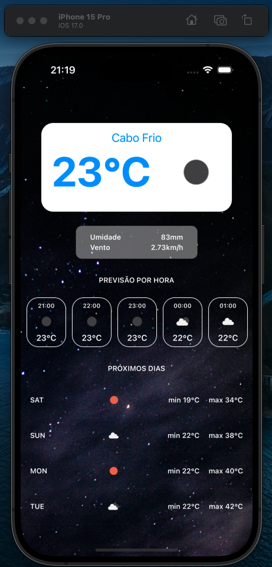

# Aplicativo de previsão do tempo

Durante meus estudos aprendi a desenvolver um aplicativo de previsão do tempo, ele faz uma requisição a uma API do tempo que através da latitude e longitude retorna valores utilizados no projeto, para mais informações clique aqui. Após isso, resolvi adicionar funcionalidades a este projeto e adicioná-lo em meu portifólio.

## Exemplo de como acessar os arquivos

O projeto deve ser executado através da IDE xcode e buildado através da tecla "Command + R"

## Informações
- Interface: UIKit (View Code)
- Linguagem: Swift
- API: [WeatherAPI](https://openweathermap.org)

## Funcionalidades adicionadas
- Dia da semana sendo traduzido p/ PTBR

## Possíveis Futuras Funcionalidades/Melhorias
- Adição de pesquisa para outras cidades
- Loading screen
- Icone do app
- Refatoração de código

## Prévia do projeto

